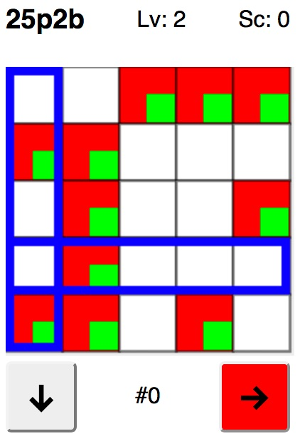

# Game of 25p2b

## How to play

On start, a random pattern is chosen as target state, shown by the red squares.
  The green squares show <em>your</em> pattern. Your goal is to shift the green squares such
  that their pattern matches that of the red ones.

The higher your level, the bigger is the difference between the red and green
  patterns.

You have two buttons, &darr; and &rarr; to move the blue frames down and to the right.
  When you change buttons, on the first press, the blue frame is not moved, but rather
  is the row or column marked by the blue frame rotated down or to the right.
  This is how you move the green squares.

Every time the green and red patterns match, your score is calculated and you
  move to the next level.

Let's see how high a score you can get!

## Ports

The game currently exists in a versiom for Browsers with HTML5 and Javascripts.
Ports to the BBC micro:bit and fantasy consoles like PICO-8 or TIC80 seem possible.  
